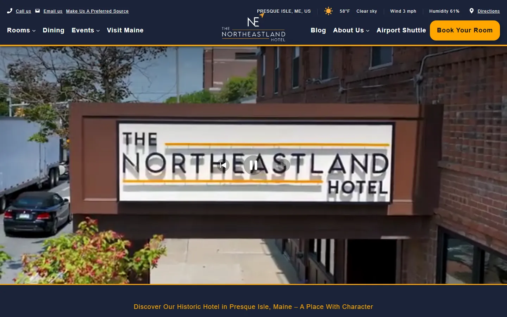

# Devon Kubacki — Portfolio

Static site, no build step. Six pages (`index`, `about`, `projects` (labeled "Work" in the nav), `services`, `gallery`, `contact`) plus `agreement.html` (linked from Services and the home page, but `noindex`), one shared stylesheet, one shared script.

`services.html` sells the Launch Package ($2,000 flat) and lists the other categories as by-quote. Its numbers (price, deposit split, $300 white-label, $60/hour, $150 restart, $500 cancellation) mirror the agreement — if you change a term in one place, change it in the other.

The site covers four categories of work — web development, SEO & content, sales, and marketing & operations. `projects.html` is grouped by those categories; the home page shows one stat and one work card per category. Non-web work cards use a `.frame .metric` tile (a headline number) in place of a screenshot.

## Deploy to Netlify

**Fastest way:** go to [app.netlify.com/drop](https://app.netlify.com/drop) and drag this whole folder in. You'll get a live URL in seconds.

**Git-based way:** push this folder to a GitHub repo, then in Netlify choose "Import an existing project" and point it at the repo. No build command needed, no publish directory needed (root is fine) — it's already plain HTML/CSS/JS.

Once deployed, add a custom domain under Site settings → Domain management if you want something other than the generated `*.netlify.app` address.

## The Launch Package agreement (`agreement.html`)

A fillable, signable version of the Launch Package contract. It's `noindex` and not in the nav, but linked from `services.html` and the home page's Launch Package band.

Submissions go through **Netlify Forms**, which needs no backend: Netlify sees the `data-netlify="true"` form at deploy time and stores every submission. To finish setup after deploying:

1. In the Netlify dashboard, open **Forms** — you should see a form named `launch-agreement`.
2. Go to **Site configuration → Notifications → Form submission notifications** and add an email notification to devon.kubacki@gmail.com so each signed agreement lands in your inbox.
3. Each submission includes: business name, email, phone, the white-label and portfolio-opt-out checkboxes, printed name, typed signature, the date they picked, and `signed_at` (a UTC timestamp set at the moment they clicked submit).

The free tier allows 100 submissions/month. A honeypot field (`bot-field`) filters basic spam.

**Local testing:** the local preview server answers POSTs with a 200, so the success state shows locally, but nothing is stored. Real submissions only work on the deployed Netlify site.

**Changing the contract:** edit the text in `agreement.html` directly. The dollar amounts in Section 3 are plain text (not fields), so update them there. If you add a new input, give it a `name` and Netlify will pick it up automatically.

## Screenshots

`images/` holds 1440×900 WebP captures of the hotel and IgnitePI sites. They were taken with `../tools/screenshot-sites.ps1`, which drives headless Edge over the DevTools protocol (no Python or Node needed on Windows), strips the hotel's cookie banner before capturing, and writes WebP directly. To refresh them after a site changes:

```
powershell -ExecutionPolicy Bypass -File ..\tools\screenshot-sites.ps1
```

Edit the `$shots` list at the top to add or change pages. Anything over ~100KB is worth re-running at a lower `-Quality`.

LD Maker Co. isn't in the gallery (the business is on hold). If it comes back, add a figure for it and capture the storefront with the script.

### Adding a screenshot by hand

Each placeholder frame shows the exact filename it expects, e.g. `images/ldmakerco-store.webp`. To swap one in:

1. Take a screenshot and drop the raw file somewhere (e.g. `raw/hotel-home.png`).
2. Run it through the optimizer:
   ```
   ../tools/optimize-images.sh raw/hotel-home.png images/hotel-home.webp
   ```
   This resizes to a sane max width and re-encodes to WebP, and warns you if it's still over 100KB.
3. In the HTML, replace:
   ```html
   <div class="pending">Screenshot pending<code>images/hotel-home.webp</code></div>
   ```
   with:
   ```html
   
   ```
4. On `gallery.html` only, also add `data-full="images/hotel-home.webp"` to the surrounding `<figure>` tag. `script.js` picks that up, makes the tile keyboard-focusable, and opens it in the native `<dialog>` lightbox on click / Enter / Space.

## Design system notes

`css/style.css` is organized as tokens → base → layout → components → footer. A few conventions worth knowing before editing:

- **Surface tokens flip inside `.on-slate`.** Components only reference `--surface`, `--text`, `--text-dim`, `--line`, and `--accent`. Wrapping any band in `.on-slate` swaps the whole palette to the dark grey-blue variant with no per-component overrides. (This band was cream "paper" originally; the token structure is what made the swap a one-block change.)
- **Type and space are fluid.** Use `--step-*` for font sizes and `--space-*` for margins/padding rather than raw rem values, so everything scales together between 360px and 1240px viewports.
- **No inline styles.** If a one-off needs styling, add a class; there are `.dim`, `.measure`, and `.eyebrow` helpers for the common cases.
- The blueprint grid is drawn on `.grid-bg::before` and masked toward the edges, so it fades rather than tiling flat across a band.

## Fonts

System fonts only, no web font requests. Headings use the system serif stack (Georgia first, since it ships on both macOS and Windows); body and UI use the system sans stack (SF / Segoe UI / Roboto / Helvetica / Arial). Both are tokens at the top of `style.css` (`--font-serif`, `--font-sans`), so switching is a one-line change.

## Local preview

No build step, but `file://` previews in some sandboxes won't load the stylesheet. Any static server works. If you're in the Claude desktop app, `.claude/launch.json` (one level up) starts a tiny PowerShell static server on port 8765.

## Adding social links

`contact.html` has a commented-out `.social-row` block with the exact markup — uncomment it and fill in real profile URLs. Left out by default rather than shipping dead placeholder buttons.

## Structure

```
index.html
about.html
projects.html
gallery.html
contact.html
css/style.css
js/script.js
images/            (screenshots)
_headers           (Netlify security headers)
robots.txt
404.html
../tools/          (screenshot-sites.ps1, optimize-images.sh — not deployed)
```
